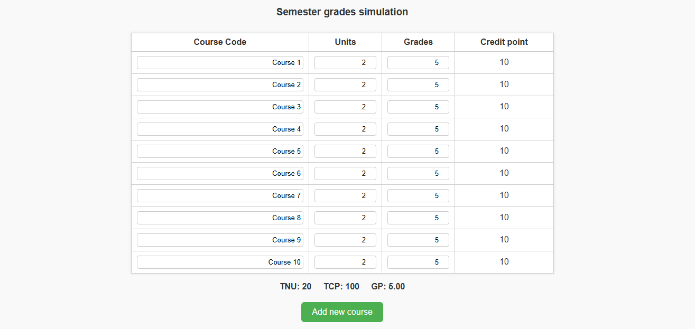

# 🎓 GPA Simulator

A simple and dynamic frontend GPA simulator that calculates a student's grade point for a semester based on course units and grades.

## 🚀 Features

- Add as many courses as needed dynamically
- Live calculation of:
  - **TNU** (Total Number of Units)
  - **TCP** (Total Credit Points)
  - **GP** (Grade Point / GPA)
- Clean UI with input validation
- Built with pure **HTML**, **CSS**, and **JavaScript**

## 🛠️ How It Works

Each course row includes:
- Course code
- Course unit
- Grade (on a 5-point scale)
- Calculated credit point (unit × grade)

You can keep adding new courses using the **"Add new course"** button. The GPA updates instantly as you modify any values.

## 🧠 Coming Soon

- Multi-semester support
- GPA projection with future inputs
- Option to combine current GPA with previous semesters
- Save and load from local storage or backend (optional)

## 📸 Screenshot

